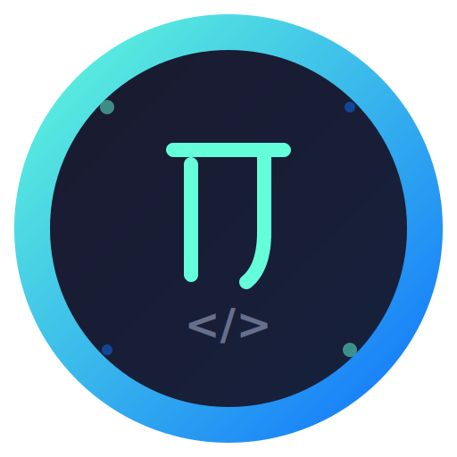

# Pi GUI

<div align="center">



**A modern desktop GUI for [pi-coding-agent](https://github.com/earendil-works/pi-coding-agent)**

[](https://tauri.app)
[](https://vuejs.org)
[](https://www.typescriptlang.org)
[](https://www.rust-lang.org)

</div>

---

## ✨ Features

### Core Features
- 🚀 **Real-time Streaming** - Watch AI responses appear in real-time
- 💬 **Interactive Chat** - Send messages, steer conversations, follow-up questions
- 🧠 **Thinking Display** - Collapsible thinking blocks for reasoning processes
- 🔧 **Tool Call Visualization** - Expand/collapse tool calls with argument inspection
- 📝 **Markdown Rendering** - Full markdown support with syntax highlighting
- 🎨 **Dark/Light Themes** - Automatic theme switching based on system preference
- 💻 **Code Editor** - Built-in CodeMirror 6 editor with syntax highlighting

### Extension Support
- 🔌 **Extension UI Dialogs** - Select, confirm, input, and editor dialogs
- 📋 **Session Management** - Create, switch, and fork sessions
- 🏷️ **Session Tags** - Color-coded tags for session organization
- 🔍 **Session Search** - Real-time filtering of sessions

### Advanced Features
- 📤 **Import/Export** - Export session data and tags to JSON
- ⌨️ **Keyboard Shortcuts** - Quick actions with Ctrl/Cmd combinations
- 🔄 **Drag & Drop** - Reorder sessions with drag and drop
- 📊 **Token Tracking** - Monitor token usage and costs
- 🖼️ **Image Paste** - Paste images directly into chat

### Keyboard Shortcuts

| Shortcut | Action |
|----------|--------|
| `Ctrl/⌘ + N` | New Session |
| `Ctrl/⌘ + /` | Toggle Sessions Panel |
| `Ctrl/⌘ + ,` | Open Settings |
| `Ctrl/⌘ + K` | Cycle Model |
| `Escape` | Close Panel/Dialog |

---

## 🚀 Quick Start

### Prerequisites

- [Node.js](https://nodejs.org/) 18+ 
- [Rust](https://www.rust-lang.org/tools/install) 1.75+
- [pi-coding-agent](https://github.com/earendil-works/pi-coding-agent) installed and available in PATH

### Installation

```bash
# Clone the repository
git clone https://github.com/your-username/pi-gui.git
cd pi-gui

# Install dependencies
npm install

# Generate icons (optional)
npm run icons
```

### Development

```bash
# Start development server
npm run tauri dev

# Build for production
npm run tauri build
```

---

## 📁 Project Structure

```
pi-gui/
├── src/                          # Frontend source
│   ├── components/
│   │   ├── chat/                 # Chat UI components
│   │   │   ├── ChatView.vue      # Main chat interface
│   │   │   ├── MessageList.vue   # Message list container
│   │   │   └── MessageItem.vue   # Individual message display
│   │   ├── input/                # Input components
│   │   │   └── InputArea.vue     # Message input with paste support
│   │   ├── settings/             # Settings UI
│   │   │   ├── SettingsPanel.vue # Settings container
│   │   │   └── ModelSelector.vue # Model selection
│   │   ├── session/              # Session management
│   │   │   └── SessionTree.vue   # Session tree with drag-drop
│   │   ├── extension/            # Extension UI
│   │   │   └── ExtensionDialog.vue # Extension dialogs
│   │   └── common/               # Shared components
│   │       ├── MarkdownRenderer.vue # Markdown rendering
│   │       └── DiffRenderer.vue  # Diff visualization
│   ├── stores/                   # Pinia state management
│   │   ├── chat.ts               # Chat messages & streaming
│   │   ├── session.ts            # Session state
│   │   ├── settings.ts           # User settings
│   │   └── ui.ts                 # Extension UI state
│   ├── ipc/                      # Tauri IPC bridge
│   │   ├── bridge.ts             # Command wrappers
│   │   └── types.ts              # TypeScript types
│   ├── App.vue                   # Root component
│   └── main.ts                   # Entry point
├── src-tauri/                    # Backend (Rust)
│   ├── src/
│   │   ├── lib.rs                # Tauri commands
│   │   ├── rpc/
│   │   │   ├── client.rs         # Pi RPC client
│   │   │   └── protocol.rs       # Protocol types
│   │   └── main.rs               # Entry point
│   ├── icons/                    # App icons
│   ├── Cargo.toml                # Rust dependencies
│   └── tauri.conf.json           # Tauri configuration
├── scripts/                      # Build scripts
│   └── generate-icons.mjs        # Icon generation
└── package.json                  # Node.js dependencies
```

---

## 🔧 Configuration

### Working Directory

The app defaults to your home directory. Change it in **Settings > General > Working Directory**.

### Models

Configure available models in the **Settings > Model** tab. The app supports:
- Multiple providers (OpenAI, Anthropic, etc.)
- Model switching with `Ctrl/⌘ + K`
- Thinking level adjustment

### Theme

Toggle between dark and light themes in **Settings > General > Dark Mode**.

---

## 🛠️ Development

### Tech Stack

- **Frontend**: Vue 3, TypeScript, Pinia, Vite
- **Backend**: Rust, Tauri 2
- **Protocol**: JSON-RPC over stdin/stdout

### Available Scripts

```bash
npm run dev          # Start Vite dev server
npm run build        # Build for production
npm run preview      # Preview production build
npm run tauri        # Tauri CLI
npm run icons        # Generate app icons
```

### Building Icons

The project includes an SVG logo that can be converted to all required icon formats:

```bash
# Edit src-tauri/icons/logo.svg
npm run icons
```

This generates:
- `32x32.png` - Small icon
- `128x128.png` - Standard icon
- `128x128@2x.png` - High DPI icon
- `icon.ico` - Windows icon
- `icon.icns` - macOS icon

---

## 📚 API Reference

### Tauri Commands

| Command | Description |
|---------|-------------|
| `pi_start` | Start the pi subprocess |
| `pi_stop` | Stop the pi subprocess |
| `pi_prompt` | Send a message |
| `pi_steer` | Steer during streaming |
| `pi_follow_up` | Send follow-up message |
| `pi_abort` | Abort current operation |
| `pi_new_session` | Create new session |
| `pi_switch_session` | Switch to different session |
| `pi_fork` | Fork from current session |
| `pi_set_model` | Change model |
| `pi_cycle_model` | Cycle through models |
| `pi_set_thinking_level` | Set thinking level |

### RPC Events

| Event | Description |
|-------|-------------|
| `agent_start` | Agent started processing |
| `agent_end` | Agent finished processing |
| `message_update` | Streaming message update |
| `tool_execution_start` | Tool call started |
| `tool_execution_end` | Tool call completed |
| `extension_ui_request` | Extension needs UI response |

---

## 🤝 Contributing

1. Fork the repository
2. Create your feature branch (`git checkout -b feature/amazing-feature`)
3. Commit your changes (`git commit -m 'Add amazing feature'`)
4. Push to the branch (`git push origin feature/amazing-feature`)
5. Open a Pull Request

---

## 📄 License

This project is licensed under the MIT License - see the [LICENSE](LICENSE) file for details.

---

## 🙏 Acknowledgments

- [pi-coding-agent](https://github.com/earendil-works/pi-coding-agent) - The AI coding assistant
- [Tauri](https://tauri.app) - Build smaller, faster, more secure desktop applications
- [Vue.js](https://vuejs.org) - The Progressive JavaScript Framework
- [Vite](https://vitejs.dev) - Next Generation Frontend Tooling

---

<div align="center">

**Made with ❤️ by Pi Community**

</div>
